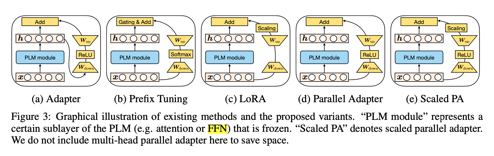
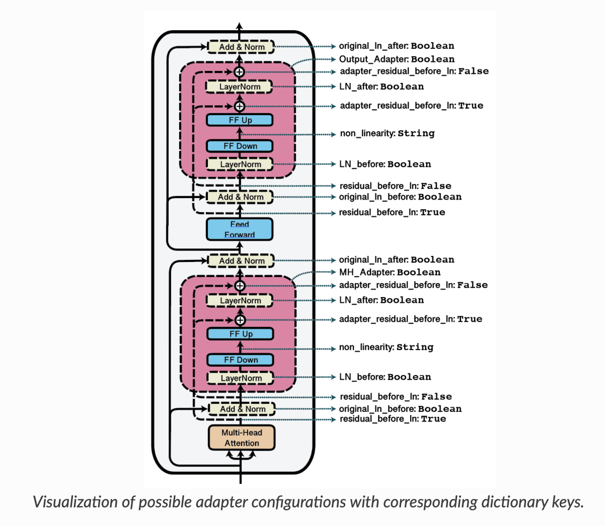
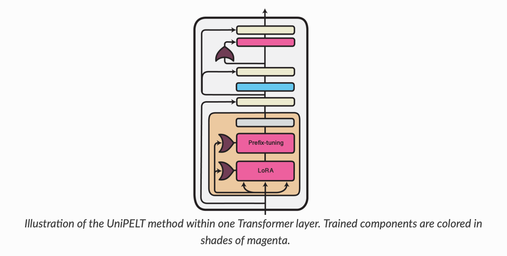

# Summary
Framework to review final push
* Decide on what to focus on 
    * Decide on parameters and reporting goals
* Decide on division of work
* Decide on final timeline

# Dimensions for review
* Amount of training data
* Different adapter types
    * Look at different adapter sizes using reduction factor
    * One or Two adapters?
        * Use one adapter for both pretraining and again for classfication 
            * For comparision, use same configuration for classification alone
        * Use two adapters - one for pretraining and a different one for classification
            * For classification, potentially mixing different pre-train and classification adapters if using two
        * One extra classification and we get both

# Deadline
* May 1st, we should target April 30th (Tuesday)
* Finish Experiments on April 21st (Sunday)- Maybe move to Wed, 24th?
* Finish Write up by April 28th (Sunday) - use Mon \ Tue for proofing

# Initial Recommendation
* Only look at Dapt
* Only look at Reviews pretraining
* Definitely use helpfulness
    * can also add IMDB if we want
* Would look to collect 3 pieces of information
    * Loss after pretraining -  Table 1
    * F1 macro no pretraining - Table 3
    * F1 macro with pretraining - Table 3
* Based on cost, recommend we go with truncated datasets
    * These costs only consider the Helpfulness Dataset for classification.  
        * We can add IMDB too, time / cost would go up
    * Discuss in our paper the time \ cost element and why we decided on the limited dataset sizes
    * We won't reach same macros in paper, but we demonstrate they are comparable
    * Recommend we do 5:
        * 3% Pretraining / 20% Classification Size = 100 minutes / $1.94
        * 3% Pretraining / 50% Classification Size = 160 minutes / #3.14
        * 3% Pretraining / 100% Classification Size = 260 minutes / $5.10
        * 4% Pretraining / 50% Classification Size = 180 minutes / $3.53
        * 5% Pretraining / 50% Classification Size = 200 minutes / $3.92
        * Total time 900 minutes / cost $17.64
        * This allows us to show:
            * pretrain (3%, 4%, 5%) at classifcation of 50%
            * classification(20%, 50%, 100%) at pretrain of 3%
        * If using just one datasize
            * Probably recommend 5% Pretraining / 20% Classification Size = about 2.5 - 3 hours, cost about $3
            * Each pass will take about 2.5 - 3 hours, cost about $3
    * Perform 3 classification steps
        * This bumps up total time to 1170 minutes and  $22.93 

# How do we divide and conquer
* Option 1 - Recommend
    * Each person takes a different adapter type
        * ParBnConfig ( ambitous this person can choose two reduction factors)
        * MAMConfig
        * UNIPELT
    * Performs 
* Option 2
    * Pick one adapter type
        * One person uses same adapter for both pretraining and classification
        * One uses other does same adapter type but seperate adapters for pretrain \ classification
            * classification on Helpfulness
        * One uses other does same adapter type but seperate adapters for pretrain \ classification
            *  classification on IMDB

    * 
* One person focuses on IMDB, another on helfpfulness

# Adapters

## Different adapter types

### Parallel Bottleneck
* Based on He's paper, section 4.6, they seem confident that parallel is better than serial.
* ParBnConfig() is parallel, but doesn't do the mixin stuff in MAM and Unipelt (below)
* A key parameter is reduction_factor, which determines the number of parameters by determining the adapter hidden layer size
* For this type of adapter, I think we would focus on reduction factor as potential sizing mechanism, two shown below
* TOWARDS A UNIFIED VIEW OF PARAMETER-EFFICIENT TRANSFER LEARNING (He et al. (2021))
* https://arxiv.org/pdf/2110.04366.pdf
* Parameter sizes

    * reduction_factor: 6

            Adapter Name: ParBN
            ================================================================================
            Name                     Architecture         #Param      %Param  Active   Train
            --------------------------------------------------------------------------------
            ParBN                    bottleneck        2,370,048       1.901       1       1
            --------------------------------------------------------------------------------
            Full model                               124,645,632     100.000               0
            ================================================================================

    * reduction_factor: 2 (Default)
    
            Adapter Name: ParBN
            ================================================================================
            Name                     Architecture         #Param      %Param  Active   Train
            --------------------------------------------------------------------------------
            ParBN                    bottleneck        7,091,712       5.689       1       1
            --------------------------------------------------------------------------------
            Full model                               124,645,632     100.000               0
            ================================================================================

### MAM
* No out of box configuration
* MAMConfig()
* dapterFusion: Non-Destructive Task Composition for Transfer Learning (Pfeiffer et al., 2021) 
* https://aclanthology.org/2021.eacl-main.39.pdf

        Adapter Name: test
        ================================================================================
        Name                     Architecture         #Param      %Param  Active   Train
        --------------------------------------------------------------------------------
        test                     union            22,493,984      18.046       1       1
        --------------------------------------------------------------------------------
        Full model                               124,645,632     100.000               0
        ================================================================================

### Unipelt
* No out of box configuration
* UNIPELT: A Unified Framework for Parameter-Efficient Language Model Tuning (Mao et al., 2022) 
* https://arxiv.org/pdf/2110.07577.pdf
* UniPELTConfig

        Adapter Name: uniPELT
        ================================================================================
        Name                     Architecture         #Param      %Param  Active   Train
        --------------------------------------------------------------------------------
        uniPELT                  union            11,083,376       8.892       1       1
        --------------------------------------------------------------------------------
        Full model                               124,645,632     100.000               0
        ================================================================================

# Code Walk Through
Setup model
    from transformers import RobertaConfig
    from adapters import AutoAdapterModel

    config = RobertaConfig.from_pretrained("roberta-base")
    classficiation_no_pretrain_model = AutoAdapterModel.from_pretrained(
        "roberta-base",
        config=config,
    )

Setup adapter

    from adapters import SeqBnConfig

    pretraining_adapter_config = SeqBnConfig()

Add adapter

    # Add a new adapter
    classficiation_from_pretrain_model.add_adapter(classification_adapter_after_pretrained_name, config=classification_adapter_config)

    # Add head for classification modeling
    classficiation_from_pretrain_model.add_classification_head(
        classification_adapter_after_pretrained_name,
        num_labels=2,
        id2label={ 0: "unhelpful", 1: "helpful"})

    # Set the adapter to be used for training
    classficiation_from_pretrain_model.train_adapter(classification_adapter_after_pretrained_name)

Need to check what is loaded, active and set for training

    summary = classficiation_from_pretrain_model.adapter_summary()
    print(summary)

    ================================================================================
    Name                     Architecture         #Param      %Param  Active   Train
    --------------------------------------------------------------------------------
    AA_adp_seq_bn_P_micro_adapterbottleneck          894,528       0.718       1       0
    AA_adp_seq_bn_P_micro_seq_bn_C_micro_adapterbottleneck          894,528       0.718       0       1
    --------------------------------------------------------------------------------
    Full model                               124,645,632     100.000               0
    ================================================================================

Loading and adding

    # Load pre-trained adapter
    load_name = f"BigTMiami/{pretrained_adapter_hub_name}"

    # Load Pretrained adapter without head
    loaded_adapter_name = classficiation_from_pretrain_model.load_adapter(load_name, with_head=False, set_active=True)

    print(f"Loaded Pretrain Adapter Name: {load_name}")

    classficiation_from_pretrain_model.add_adapter(classification_adapter_after_pretrained_name, config=classification_adapter_config)

    # Add head for classification modeling
    classficiation_from_pretrain_model.add_classification_head(
        classification_adapter_after_pretrained_name,
        num_labels=2,
        id2label={ 0: "unhelpful", 1: "helpful"})

    # Set the adapter to be used for training
    classficiation_from_pretrain_model.train_adapter(classification_adapter_after_pretrained_name)

    classficiation_from_pretrain_model.set_active_adapters([loaded_adapter_name, classification_adapter_after_pretrained_name])

!!! Run adapter_summary() to make sure what is loaded active and training

# Questions
* Do we use best model on pre-training?
    * For this we would need to set a steps evaluation threshold
    * Do we capture at which step 
* Do we use best model on classification?
    * Would probably use epochs here - only three
* Do we use multiple seeds?
    * I don't think so
    * At most I would think to use 3 different seeds
    * This would triple the time \ cost

## Time / Cost
### Colab cost
* 10 units = $1
* A100 = 11.77 units / hour
* Cost \ minute = $ .0196 / minute

### Pretraining
* Using an A100, the training task using a batch size of 32 and accumlation steps of 11 
* ~ 20 minutes per 1%
* Total times 
    * 3% = ~ 51 minutes / $1
    * 5% = ~ 102 minutes / $2
    * 10% = ~ 200 minutes / $4
    * 20% = ~ 400 minutes / $8

### Classification
* Using A100, batch size of 16
*  ~ 1 minute per 1%
* One classification run (2 needed for each adapter)
    * 5% = 6 minutes / $0.11
    * 20% = 20 minutes / $0.41
    * 100% = 100 minutes / $1.96

### Overall Time / Cost
* 5% Pretraining / 20% Classification Size = 140 minutes / $2.74
* 10% Pretraining / 50% Classification Size = 300 minutes / $5.88
* 20% Pretraining / 10% Classification Size = 600 minutes / $11.76

### Cost Time Details
### Pretraining
* Cost
    * 10 units = $1
    * A100 = 11.77 units / hour
    * Cost \ minute = $ .0196 / minute
* Using an A100, the training task using a batch size of 32 and accumlation steps of 11 
    * Per % time
        * 3% = 3109 = ~ 17 minutes per 1 %
        * 4% = 3896, 3946 = ~ 16 minutes per 1%
        * 5% = 6135 (DoubleSeqBnInvConfig) = ~ 20 minutes per 1%
    * Total times 
        * 3% = ~ 51 minutes / $1
        * 4% = ~ 65 minutes / $1.27
        * 5% = ~ 102 minutes / $2
        * 10% = ~ 200 minutes / $4
        * 20% = ~ 400 minutes / $8

### Classification
* Using A100, batch size of 16
    * 5% = (354, 348) = 1.2 minutes per 1%
    * 20% = (1258, 1305) = 1.09 minutes per 1%
    * 30% = (1753, 1754, 1750 ) = ~ 1 minute per 1%

* Total Cost
    * One classification run
        * 5% = 6 minutes / $0.11
        * 20% = 20 minutes / $0.41
        * 100% = 100 minutes / $1.96

